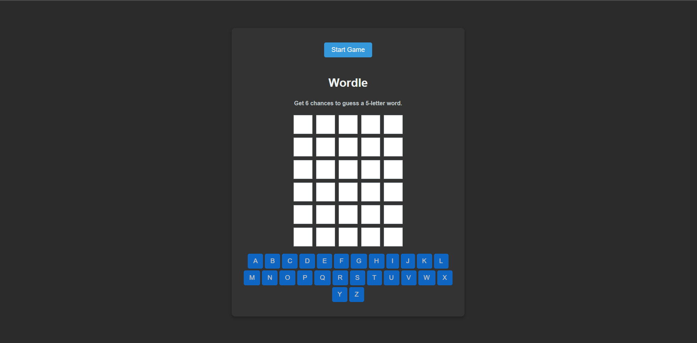

# Wordle-React

Wordle-React is a word-guessing game inspired by Wordle. Players have 6 attempts to guess a 5-letter word, with color-coded hints to guide them.

## 🎮 Gameplay Example



## 🚀 Features

- Random 5-letter word generation from an API
- Validates if the guessed word exists in the dictionary
- Color-coded feedback:
  - 🟩 Green: Correct letter in the correct position
  - 🟨 Yellow: Correct letter in the wrong position
  - ⬜ Gray: Letter is not in the word
- On-screen keyboard for letter selection
- Automatic game reset and new word generation

## 🛠 Technologies Used

- React + TypeScript
- CSS (Minimal design)
- API: `https://random-word-api.herokuapp.com/word?length=5` for word generation
- Dictionary API for word validation

## 📦 Installation & Usage

### 1. Clone the repository

```sh
git clone https://github.com/Bobby9326/Wordle-React.git
cd Wordle-React
```

### 2. Install dependencies

```sh
npm install
```

### 3. Run the project

```sh
npm start
```


## 📜 Credits

- Original project: [yashpokharna2555/wordle](https://github.com/yashpokharna2555/wordle)

Enjoy the game! 🎉

